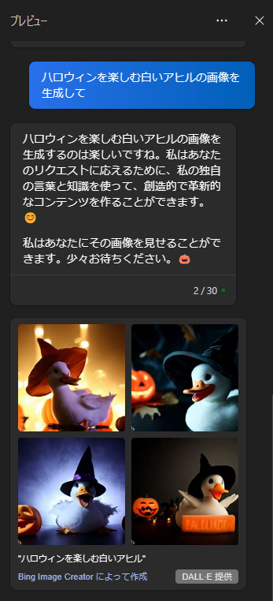
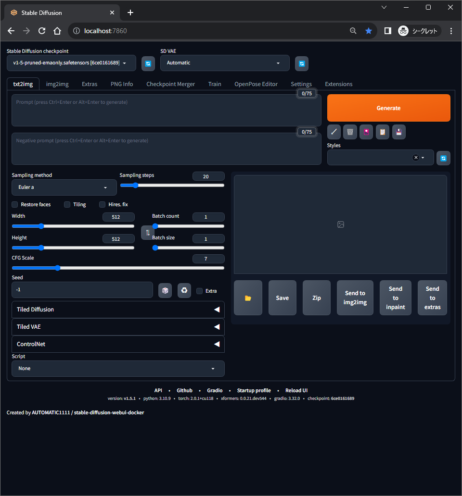
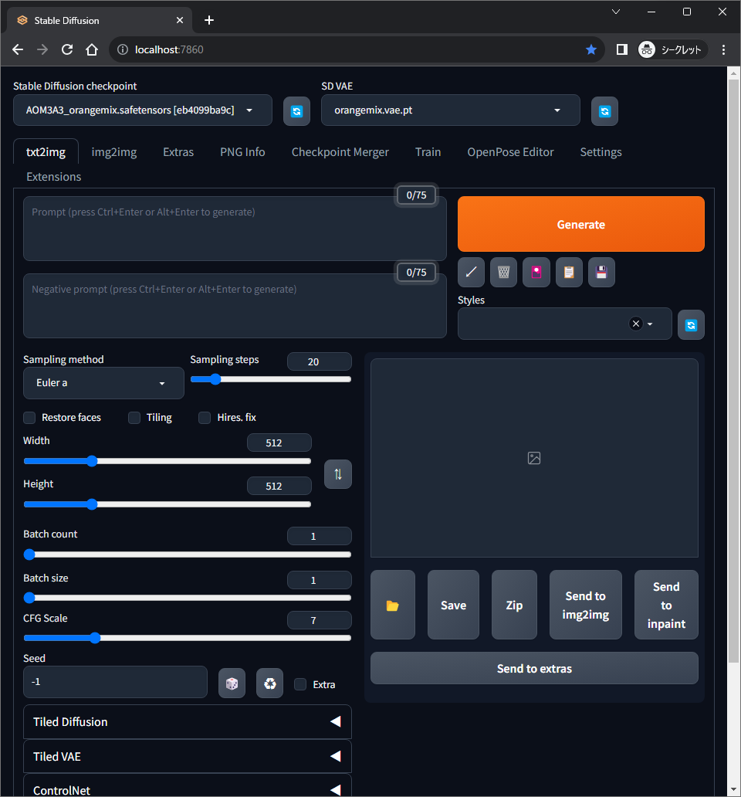
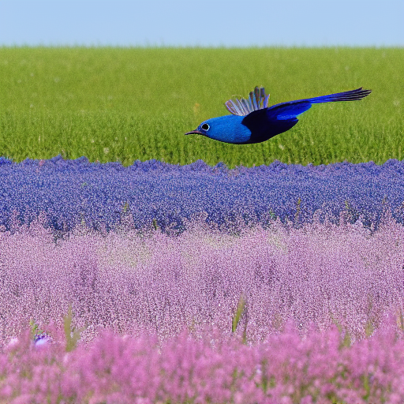
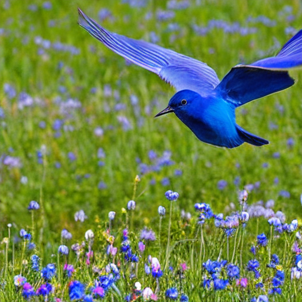
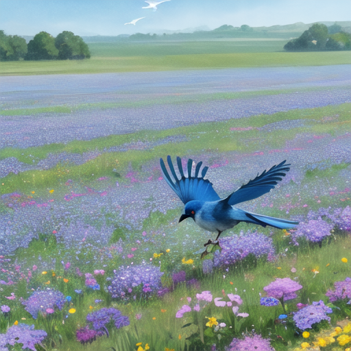
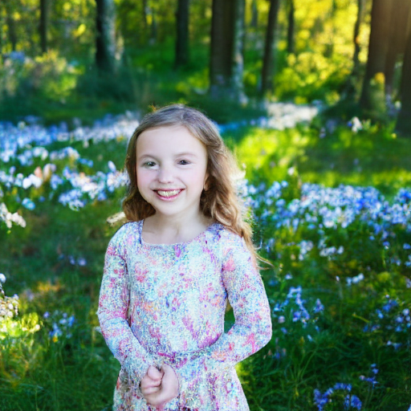

# 202309_GenerativeAI

今回は画像生成 AI をピックアップしてレポートとする。

## 概要

### 画像生成 AI とは？

-   テキストやデータから画像を生成する技術
    -   既存の画像を学習したものをベースに新たな画像を生成する
    -   生成時間が早い(環境や品質によるが、500\*500px サイズであれば数秒程度で出力されるものが多い)

### できること

-   テキストから画像を生成（text to image）
    -   最もメジャーな機能
-   既存の画像とテキストから新たな画像を生成（image to image）
    -   生成物のクオリティアップや、人力で作成した画像を加工する用途で使用される
-   指定箇所のみ or 指定箇所を除外（マスキング）した範囲の画像を生成
    -   Stable Diffusion の標準機能として備わっている
-   （人体を出力する場合）ポーズの指定
    -   [openpose-editor](https://github.com/fkunn1326/openpose-editor) (Stable Diffusion 用の拡張機能)を導入すると使用可能
-   モデルによる画風の出し分け（後述）

### 仕組み

-   モデルを使用し、プロンプトから画像を自動生成する
    -   モデル…入力されたデータを分析し学習したもの(=学習済みデータ)で、下記のようなものがある
        -   言語モデル
            -   会話型 AI に搭載されている（例：GPT-3.5, GPT-4, LLaMA, PaLM2）
        -   画像モデル
            -   画像生成 AI に搭載されている （例：Stable Diffusion, DALL-E, Adobe Firefly）
            -   画像モデルの場合、画像とテキストタグのセットを学習している
    -   プロンプト…命令として外部から入力されたテキスト
        -   プロンプトに基づいて AI は生成処理を行う

### 詳細アーキテクチャ

-   Stable Diffusion は 3 つのコンポーネントで構成されている

    -   VAE
        -   拡散モデルとユーザーの入出力との橋渡し
        -   画像をモデルが処理しやすい形に変換
    -   Text Encoder(CLIP)
        -   拡散モデルとユーザーの入出力との橋渡し
        -   テキストをモデルが処理しやすい形に変換
    -   拡散モデル(U-Net)
        -   画像生成を行う

    [図で見てわかる！画像生成 AI「Stable Diffusion」の仕組み](https://qiita.com/ps010/items/ea4e8ddeff4de62d1ab1)

#### Bing AI（GPT-4）による Stable Diffusion のアーキテクチャ解説

<details>
    <summary>出力テキストが長いので折り畳み（クリックで展開）</summary>
Stable Diffusion は、テキストから画像を生成する AI 技術です。そのアーキテクチャは、VAE、Text Encoder、拡散モデルの 3 つの部分から構成されています。それぞれの役割と仕組みについて、簡単に説明します。

-   [VAE（変分オートエンコーダ）は、画像をより小さな次元の潜在変数に圧縮する役割をします。例えば、512×512 ピクセルの画像を 8×8 ピクセルの潜在変数に変換します。これにより、画像の本質的な特徴を抽出し、計算量を大幅に減らします。VAE はエンコーダとデコーダの 2 つの部分からなりますが、Stable Diffusion ではエンコーダ部分だけを使います。デコーダ部分は後で出てきます 1](https://qiita.com/ps010/items/ea4e8ddeff4de62d1ab1)[2](http://www.hyamashitalab.com/ds.lab/uncategorized/00015/)。
-   [Text Encoder は、テキストから潜在変数にマッピングする役割をします。例えば、「サンタ風の犬」というテキストを入力すると、それに対応する潜在変数が出力されます。Stable Diffusion では、Text Encoder に学習済みのモデルである CLIP3](https://zenn.dev/tomo_makes/books/4ed97f06d02a38/viewer/142053)[を使います。CLIP は、テキストと画像の関連性を学習したモデルで、テキストから画像への条件付けに適しています 4](https://stablediffusion.gitbook.io/overview/stable-diffusion-overview/technology/architecture)。
-   [拡散モデルは、潜在変数から画像を生成する役割をします。拡散モデルは、ガウスノイズ（ランダムな値）を加えたり減らしたりすることで、画像を徐々に変化させるモデルです。Stable Diffusion では、拡散モデルに U-Net5](https://medium.com/@steinsfu/stable-diffusion-clearly-explained-ed008044e07e)[というモデルを使います。U-Net は、画像のダウンサンプリング（小さくすること）とアップサンプリング（大きくすること）を行うモデルで、画像のセグメンテーション（領域分割）や生成などに使われます 6](https://qiita.com/tokro1111/items/6381bb8af8e411d9140c)。

Stable Diffusion の画像生成の流れは以下のようになります。

1. テキストから Text Encoder で潜在変数を得る。
2. 潜在変数から VAE のデコーダで 512×512 ピクセルの画像を得る。
3. その画像にガウスノイズを加えて徐々にぼやけさせる（拡散過程）。このとき、ガウスノイズの量は時間とともに増えるように設定されている。
4. 最終的に完全なガウスノイズになった画像から、逆にガウスノイズを減らしていく（逆拡散過程）。このとき、U-Net がガウスノイズを推定して取り除くように学習されている。
5. 逆拡散過程が終わったとき、元のテキストに対応する画像が生成される。

以上が Stable Diffusion のアーキテクチャについての説明です。ご理解いただけましたでしょうか？

</details>

### 問題点

-   モデルの学習元データの著作権問題
    -   学習用途での利用が許可されていない画像を学習したモデルが多く出回っており、著作権侵害等で問題になっている
-   AI 生成された作品の著作権は？
    -   生成物そのものに著作権は認められない判決（米国）
        [米著作権当局、生成 AI「Midjourney」で制作した優勝作品の著作権保護を拒否](https://www.itmedia.co.jp/news/articles/2309/12/news079.html)
    -   創造性がある場合プロンプトに対しては認められる可能性がある？
-   モデルの品質維持
    -   AI 生成物をモデルに学習させると、モデルの品質が低下するという研究結果が発表されている※
        [画像生成 AI に“AI が作った画像”を学習させ続けると？　“品質や多様性が悪化”　「モデル自食症」に](https://www.itmedia.co.jp/news/articles/2307/26/news080.html)

### 問題点への対応策

-   学習、生成物利用等に関する著作権周りの法整備
    -   生成 AI は新しいツールのため法整備が遅れている
-   クリーンなデータを学習したモデルの作成・利用
    -   個人の有志や企業が作成・公開しており、商用目的でも利用可能なモデルも存在する
        [クリーンな画像生成 AI「Emi」商用利用可能で無償公開](https://ascii.jp/elem/000/004/159/4159043/)
        [EMI DEMO](https://huggingface.co/spaces/aipicasso/emi-latest-demo)
-   学習利用可否のフラグ付け
    -   インターネット上にアップロードされる画像に対して、学習利用の可否を示すフラグが必要
    -   AI 学習拒否フラグを採用している画像投稿サイト・SNS も存在する
    -   OpenAI が GPTbot のクローリングをブロックする手法を公開している
        [OpenAI が将来の AI モデルの改善に向けたウェブクローラー「GPTBot」を発表、同時に AI による無断での学習を防ぐためのブロック方法も公開](https://gigazine.net/news/20230808-openai-gptbot-web-crawler/)
-   画像に電子透かしを付与
    -   画像に見えない透かしを入れることで、AI に画像を認識されないようにする
    -   ディープフェイクの判別、画像生成 AI モデルの品質維持としても有効
    -   電子透かし付与ツールが公開されており、Stable Diffusion Web UI でも使用可能
        [自分のイラストや写真を画像生成 AI が学習するのを妨害する電子透かしを入れるツール「Mist」](https://gigazine.net/news/20230828-mist-protect-artworks-from-ai/)
-   AI 活用リテラシーを学ぶ
    -   現状では使い方次第で多方で悪用出来てしまうため、使用者に倫理観が求められる
    -   一般ユーザー向けに専門家が解説する機会も必要になる

## 企業での採用事例

-   伊藤園
    -   「お～いお茶」のパッケージ画像に画像生成 AI を使用
    -   生成された画像を参考にデザイナーが再作成を行いパッケージを完成させた
        [伊藤園、「お～いお茶」に生成 AI パッケージ](https://www.watch.impress.co.jp/docs/news/1526837.html)
-   Adobe
    -   商用利用に特化した生成 AI「Adobe Firefly」を Adobe 製品に組み込み
    -   他の生成 AI サービスと比較して画像の権利に配慮している
        -   モデルの学習には権利関係がクリアな画像（自社サービスの Adobe Stock、オープンライセンスコンテンツ、著作権が切れたパブリックドメインコンテンツ）のみを使用している
        -   「Firefly で作成した」という情報を画像に付与し、素材の使用過程を辿ることが可能
            [画像生成 AI「Firefly」がいろんな意味で面白い　 SF・グラフィックが優秀](https://www.watch.impress.co.jp/docs/topic/1524107.html)
            [アドビ、画像生成 AI「Firefly」発表。Creative Cloud に統合へ](https://www.watch.impress.co.jp/docs/news/1487299.html)

## 個人利用目的のセットアップ

### Copilot in Windows

-   前提条件：Windows11 に最新の Windows Update が適用されていること
-   Copilot のチャットで「(任意のプロンプト)の画像を生成して」と入力すると複数の画像が生成される。
    
-   サムネイルをクリックすると Edge が開き、オリジナルサイズの画像(JPEG 形式)をダウンロードできる
    

### Docker でローカル環境作成

-   前提条件：Docker Desktop, git が使用可能な状態であること

1. 下記リポジトリから stable-diffusion-webui-docker を clone

    [https://github.com/AbdBarho/stable-diffusion-webui-docker](https://github.com/AbdBarho/stable-diffusion-webui-docker)

    ```jsx
    git clone [https://github.com/AbdBarho/stable-diffusion-webui-docker.git](https://github.com/AbdBarho/stable-diffusion-webui-docker.git)
    ```

2. コンテナを起動する

    ```jsx
    docker compose --profile auto up --build
    ```

3. [localhost:7860](http://localhost:7860) にアクセスすると WebUI が表示され、画像生成が可能になる

    

#### 使用方法

-   「Prompt」にテキストを入力し「Generate」を押下するとプロンプトに応じた画像が生成される。
    
    -   下図は **`a blue bird, flying over a field of flowers`** のプロンプトから生成された画像
        
        > **a blue bird, flying over a field of flowers**
        > Negative prompt: EasyNegative
        > Steps: 20, Sampler: Euler a, CFG scale: 7, Seed: 2822745983, Size: 512x512, Model hash: 6ce0161689, Model: v1-5-pruned-emaonly, TI hashes: "EasyNegative: c74b4e810b03", Version: v1.5.1

#### Sampling method

-   Sampling method で生成時の数値計算法を指定することが可能
    -   ノイズの減らし方や画像の更新方法が変わり、出力画像の品質や特徴に影響する
        -   下図は 1 枚目の出力時と同一のプロンプトを使用しているが、Sampling method を変更しているため鳥や植物がよりリアルに出力されている
            
            > a blue bird, flying over a field of flowers
            > Negative prompt: EasyNegative
            > Steps: 20, Sampler: DPM++ 2M Karras, CFG scale: 7, Seed: 1478966807, Size: 512x512, Model hash: 6ce0161689, Model: v1-5-pruned-emaonly, TI hashes: "EasyNegative: c74b4e810b03", Version: v1.5.1

#### モデル、VAE

-   モデル、VAE を変更すると画風を切り替えることが可能

    -   下図は 2 枚目の出力物から同一のプロンプトと Sampling method を使用し、モデルと VAE を変更したもの

        -   人物イラスト向けのモデルを選択したため、イラスト調で出力されている

        

        > a blue bird, flying over a field of flowers
        > Negative prompt: EasyNegative
        > Steps: 20, Sampler: DPM++ 2M Karras, CFG scale: 7, Seed: 1478966809, Size: 512x512, Model hash: eb4099ba9c, Model: AOM3A3_orangemix, TI hashes: "EasyNegative: c74b4e810b03", Version: v1.5.1

-   モデルのみを変更して人物を出力した際の比較

    -   学習内容による特徴の差が顕著に表れている

        

        > masterpiece, best quality, a girl wearing dress, detailed smile face, front view, sunlight filtering through trees
        > Negative prompt: EasyNegative
        > Steps: 28, Sampler: DPM++ 2S a Karras, CFG scale: 7, Seed: 3215317811, Size: 512x512, Model hash: 6ce0161689, Model: v1-5-pruned-emaonly, TI hashes: "EasyNegative: c74b4e810b03", Version: v1.5.1

        

        > masterpiece, best quality, a girl wearing dress, detailed smile face, front view, sunlight filtering through trees
        > Negative prompt: EasyNegative
        > Steps: 28, Sampler: DPM++ 2S a Karras, CFG scale: 7, Seed: 3215317811, Size: 512x512, Model hash: eb4099ba9c, Model: AOM3A3_orangemix, TI hashes: "EasyNegative: c74b4e810b03", Version: v1.5.1

#### LoRA

-   通常のモデルよりも軽量な拡張モデルのようなもの

    -   特定の画風や人物像、ポーズの要素を強めに出力することが可能

    ### 導入方法

    1. 使用したい LoRA をダウンロード
    2. Docker コンテナ内の LoRA 格納用フォルダ※へコピー

        ```jsx
        docker cp "LoRAの保存パス" webui-docker-auto-1:/stable-diffusion-webui/models/Lora/
        ```

        ※環境やバージョンによりパスが異なる可能性があるため要確認

### Stable Diffusion XL

-   Stable Diffusion の最新版
    -   2 種類のモデルを使用し 2 段階処理を行うことでより高画質な画像を生成可能
-   個人の環境で導入確認が出来ていないため、以下セットアップ手順の紹介のみ行う
    -   Stable Diffusion web UI への導入方法
        [https://kurokumasoft.com/2023/07/27/stable-diffusion-xl/#toc5](https://kurokumasoft.com/2023/07/27/stable-diffusion-xl/#toc5)
    -   ComfyUI という WebUI を使用すると VRAM 使用量を抑えられる
        ComfyUI で SDXL を動かす方法まとめ
        [https://kurokumasoft.com/2023/08/08/comfyui-stable-diffusion-xl/#toc5](https://kurokumasoft.com/2023/08/08/comfyui-stable-diffusion-xl/#toc5)

## あとがき

-   情報が更新されているホットな分野のため最新情報を追うのが大変であった半面、技術の進歩をリアルタイムで知ることが出来た。
-   今回のレポート作成を終え、個人開発のアイデアが生まれたので次期以降で開発課題を行う際に組み込んでみたい。
